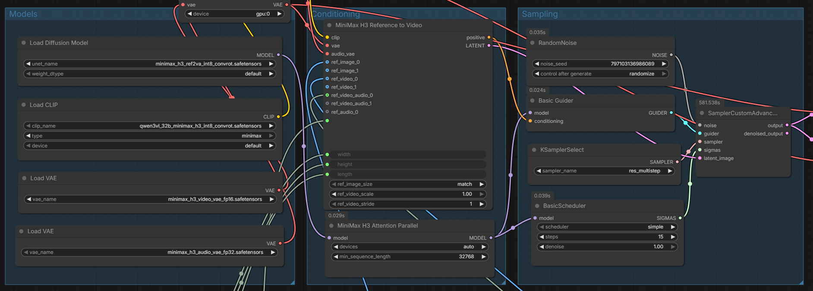

# ComfyUI MiniMax H3 Parallel Attention

Exact activation-only attention-head sharding for MiniMax H3 Ref2VA. The
MiniMax model, text encoder, and VAEs stay on their normal devices; helper GPUs
receive only packed INT8 Q/K/V head slices and return BF16 attention outputs.

## Requirements

- ComfyUI 0.33.0 or newer
- Comfy Kitchen 0.2.31 or a compatible newer release with CUDA INT8 attention
- two to four visible NVIDIA CUDA GPUs with bidirectional peer access
- a MiniMax H3 model using the native ComfyUI integration

The tested system used four RTX PRO 6000 Blackwell GPUs. Other NVIDIA devices
supported by Comfy Kitchen should work, but have not been benchmarked here.

## Install

Clone the repository into `ComfyUI/custom_nodes` and restart ComfyUI:

```bash
cd ComfyUI/custom_nodes
git clone https://github.com/AesSedai/ComfyUI-MiniMaxH3-Parallel.git
```

ComfyUI Manager can install the same repository URL with **Install via Git
URL**. Public Manager/Registry listing additionally requires publishing the
repository and adding the publisher metadata assigned by the Comfy Registry.

No additional Python packages are installed; the node uses the Comfy Kitchen
version supplied by ComfyUI.

## Launch and use

Expose every participating GPU to the one ComfyUI process:

```bash
CUDA_VISIBLE_DEVICES=0,1,2,3 python main.py --use-ck-attention
```

Wire the model path as:

```text
Load Diffusion Model -> MiniMax H3 Attention Parallel -> scheduler and guider
```



`devices` counts the model GPU as well as helpers. For example, `4` means one
model GPU plus three activation-only helpers. `auto` uses up to four suitable
visible GPUs and honors `min_sequence_length`; an explicit count fails early
if that many peer-accessible CK-capable GPUs are not available.

Launch ComfyUI with `--use-ck-attention` so the model uses the required Comfy
Kitchen INT8 attention path. Do not add `Torch Compile Model` to this graph:
measured four-step Ref2VA runs gained only about 1.5% in steady state and
diverged substantially from the eager trajectory.

## Measured reference results

### Test system and workload

- four NVIDIA RTX PRO 6000 Blackwell Max-Q 96 GB GPUs
- ComfyUI 0.33.0, PyTorch 2.10.0+cu130, Comfy Kitchen 0.2.31
- `minimax_h3_ref2va_int8_convrot.safetensors`
- 0.7 MP portrait output: 640x1152, 158 frames, 6.58 seconds
- reference image, reference video, and its audio
- `res_multistep`, `simple`, four sampling steps, fixed seed, no compile
- packed attention shape `[1, 56, 93312, 128]`

The server was warmed with one complete one-step prompt. Each measured prompt
used fresh graph IDs, forcing reference conditioning, sampling, decode, and save
to execute while retaining normal resident model/file caches. Timings below are
wall-clock node-transition measurements from ComfyUI's websocket.

### Ref2VA workflow

| Devices | Head split | Conditioning | Denoising | Seconds/step | Decode | Create/save | End-to-end | Denoiser speedup | End-to-end speedup |
|---:|:---|---:|---:|---:|---:|---:|---:|---:|---:|
| disabled | 56 | 56.78 s | 153.78 s | 38.45 s | 9.68 s | 3.78 s | 224.04 s | 1.00x | 1.00x |
| 2 | 28/28 | 57.37 s | 102.26 s | 25.56 s | 24.79 s | 3.55 s | 187.98 s | 1.50x | 1.19x |
| 3 | 19/19/18 | 56.61 s | 84.32 s | 21.08 s | 24.78 s | 3.81 s | 169.54 s | 1.82x | 1.32x |
| 4 | 14/14/14/14 | 57.16 s | 76.01 s | 19.00 s | 24.84 s | 3.40 s | 161.41 s | 2.02x | 1.39x |

`disabled` used the stock globally selected CK backend. The four-GPU mode cut
denoising time by 50.6% and total workflow time by 28.0%. Conditioning and VAE
decode remain single-device work, so they limit end-to-end scaling. Decode was
also variable in this run: the disabled control took 9.68 seconds while the
subsequent measurements took about 24.8 seconds. Denoiser timing is therefore
the cleaner comparison between device counts.

All four saved outputs had identical decoded video and audio SHA-256 hashes.
The device setting changed performance without changing the generated result.

### Attention-only synthetic benchmark

Median steady-state critical-path time at the same packed attention shape:

| Devices | Head split | Attention | Speedup |
|---:|:---|---:|---:|
| 1 | 56 | 534.4 ms | 1.00x |
| 2 | 28/28 | 326.6 ms | 1.64x |
| 3 | 19/19/18 | 235.7 ms | 2.27x |
| 4 | 14/14/14/14 | 197.2 ms | 2.71x |

Measured helper peak allocation was 1.56 GiB for the 28-head split, about
1.06/1.01 GiB for the 19/18-head helpers, and 0.78 GiB per helper for the
14-head split. Helper GPUs did not load model weights.

## Limitations

- CUDA and Comfy Kitchen INT8 attention only
- no attention masks or grouped-query head mismatch
- helpers share the process and must have bidirectional CUDA peer access
- the packed-head adapter is tested against Comfy Kitchen 0.2.31; retest exact
  output when changing Comfy Kitchen versions
